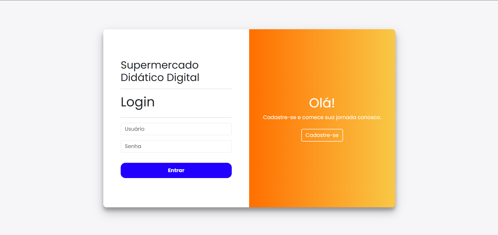
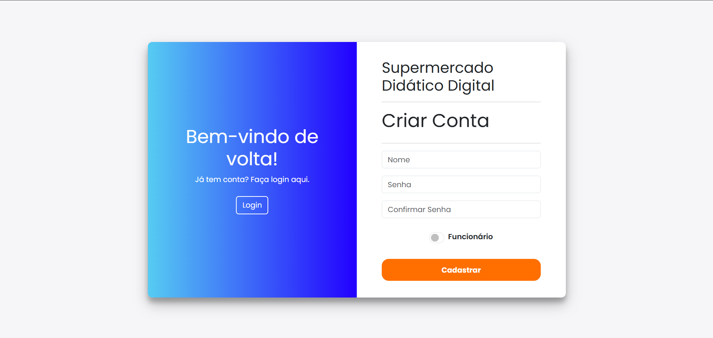
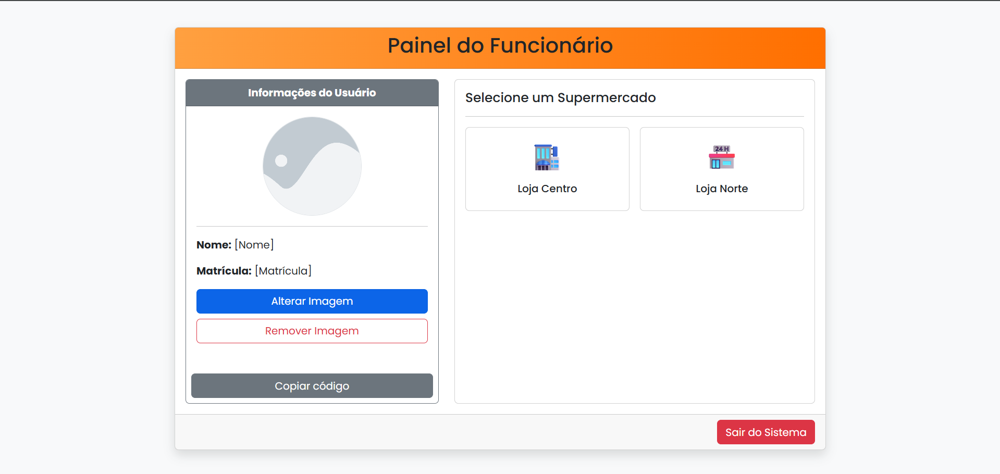
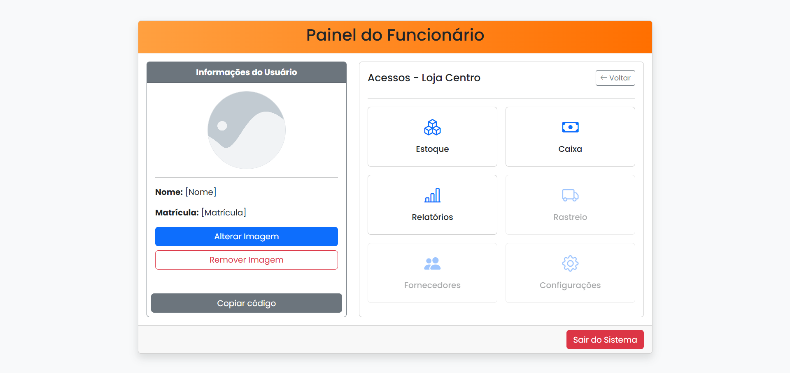
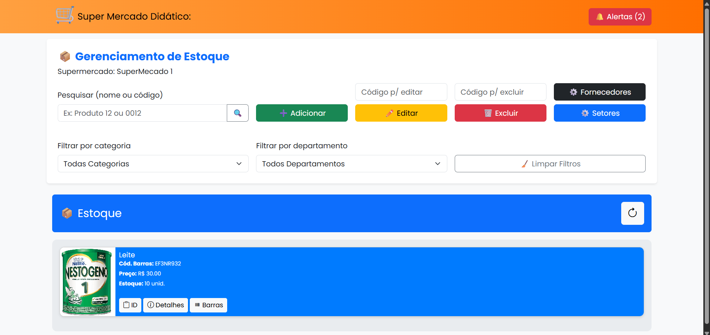
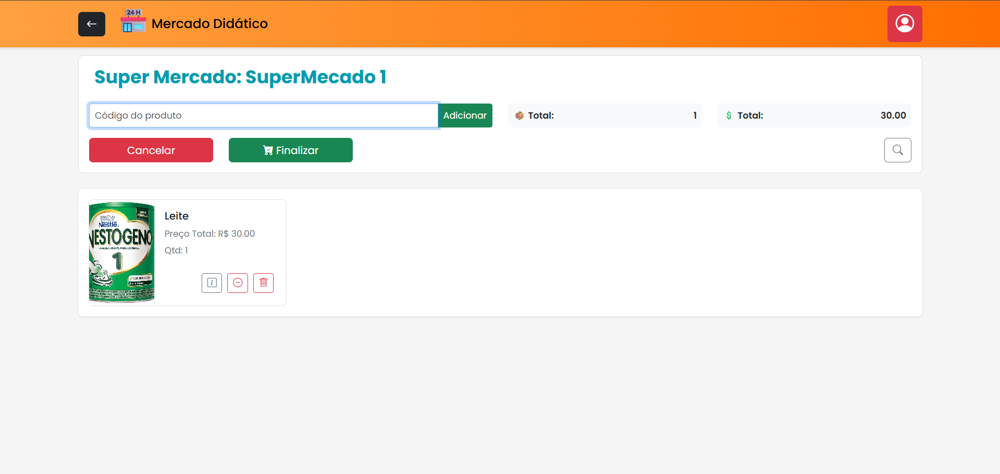
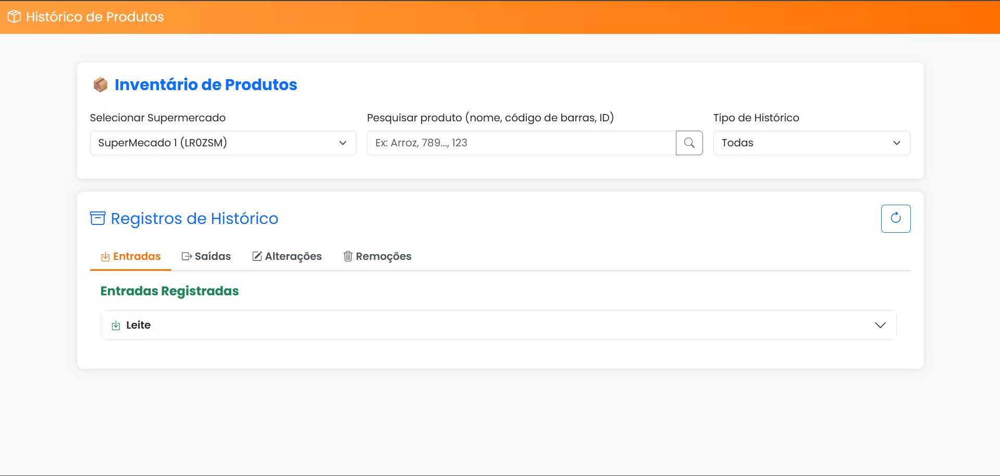
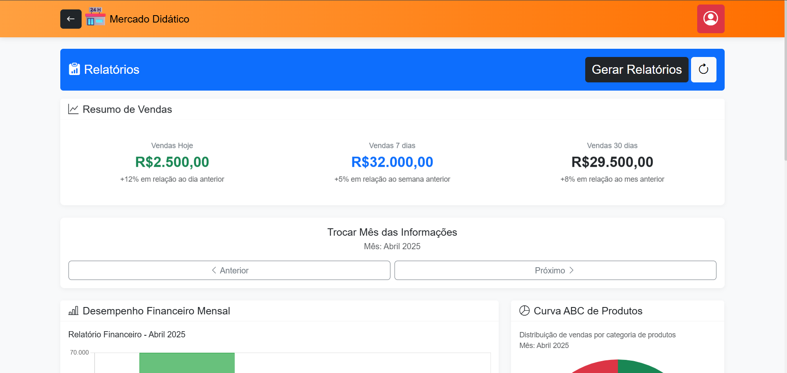
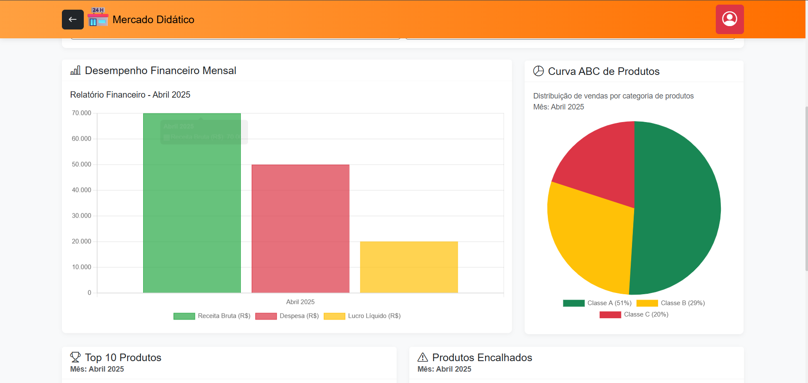

# 🛒 Supermercado Web -  SENAC Divinópolis

Sistema completo de gerenciamento de supermercado 100% Web e **open-source**, desenvolvido para uso educacional e institucional pela **Rede de Ensino do SENAC**.

Este projeto foi desenvolvido pela **turma de Desenvolvimento de Sistemas (046.2024.0035)** da unidade **SENAC Divinópolis**, sob a proposta do instrutor **Michael Ferreira**. O sistema permite controle de estoque em tempo real, operação de caixa, cadastro de novos mercados, e muito mais!

---

## 🚀 Funcionalidades

- ✅ **Controle de Estoque em Tempo Real**
- ✅ **Sistema de Caixa**
- ✅ **Cadastro e Gerenciamento de Produtos**
- ✅ **Cadastro de Novos Supermercados**
- ✅ **Interface Amigável e Intuitiva**
- ✅ **Integração com Banco de Dados Local**
- ✅ **Open Source para fins didáticos e expansíveis**

---

## 👨‍💻 Equipe de Desenvolvimento

Desenvolvido com 💙 pela turma 0035:

- **André Luis**
- **Arthur Otavio**
- **Bernado Gualberto**
- **Bruna Gontijo**
- **Gabriel Henrique**
- **Hugo Pierre**
- **Kaique Madureira**
- **Leonardo Vidigal**
- **Pedro Henrique**

---

## 🧑‍🏫 Proposta Pedagógica

Este projeto faz parte da proposta educativa da **Rede de Ensino SENAC**, promovendo o desenvolvimento prático de soluções web aplicadas a cenários reais, com foco em **tecnologias web modernas**, **banco de dados**, **UI/UX** e **gestão de sistemas integrados**.

---

## 🛠 Tecnologias Utilizadas

- HTML5, CSS3, JavaScript
- Node.js com Express
- SQLite3 (Banco de dados leve e local)
- Bootstrap 5 (Frontend responsivo)
- Multer

---

### Nossas Telas e suas Funcionalidades

---

#### **Tela de Autenticação: Login e Cadastro**
Faça seu login e cadastro para acessar o sistema.

<p align="center">
  
  
</p>

---

#### **Tela do Usuário: Painel de Controle**
Aqui o usuário visualiza e edita suas informações pessoais, além de gerenciar os supermercados dos quais faz parte.

<p align="center">
  
  
</p>

---

#### **Tela de Gestão de Estoque**
Registre, edite e remova todos os produtos do supermercado nesta seção.

<p align="center">
  
</p>

---

#### **Tela de Ponto de Venda (PDV)**
Realize a venda de produtos adicionando-os com seu código de barras ou busca.

<p align="center">
  
</p>

---

#### **Tela de Histórico do Estoque**
Visualize todas as mudanças no estoque, incluindo adições e remoções por compras, vendas ou outras operações.

<p align="center">
  
</p>

---

#### **Tela de Fornecedores**
Gerencie e visualize as informações dos fornecedores do seu supermercado.

<p align="center">
  
</p>

---

#### **Tela de Relatórios e Análises**
Gere relatórios detalhados sobre produtos mais e menos vendidos, gastos, lucros, Curva ABC e outras informações estratégicas.

<p align="center">
  
  
</p>

---
## 📂 Como Executar

# Clone o repositório
```bash
git clone https://github.com/vidigalbz/SupermercadoWeb.git
```
# Instale as dependências
```bash
cd supermercadoWeb
npm install express
npm install multer
npm install sqlite3
npm i install cookie-parser
```
# Inicie o servidor
```bash
node express.js
